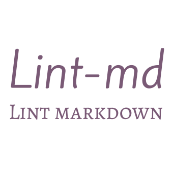

> 用于检查中文 markdown 编写格式规范的命令行工具，基于 AST 开发，且方便集成 ci；同时提供 API 方法调用。Cli tool to lint your markdown file for Chinese.

[](https://travis-ci.org/hustcc/lint-md)
[](https://coveralls.io/github/hustcc/lint-md)
[](https://www.npmjs.com/package/lint-md)
[](https://www.npmjs.com/package/lint-md)


## 安装

> **npm i -g lint-md**


## 使用

```bash
Usage: <lint-md> <files...> [options]

lint your markdown files

Options:
  -v, --version                  output the version number
  -c, --config [configure-file]  use the configure file, default .lintmdrc
  -f, --fix                      fix the errors automatically
  -h, --help                     output usage information
```


 - 校验 lint

```bash
lint-md README.md Document.md
```


 - 修复 fix
 
```bash
lint-md README.md Document.md --fix
```


## 检查类型

> 检查规则来源于 [chinese-document-style-guide](https://github.com/ruanyf/document-style-guide).

| 规则 | 详细描述 | 解决办法 |
| ------ | ------ | ------ |
| space-round-alphabet | 中文与英文之间需要增加空格 | 对应提示的位置增加空格 |
| space-round-number | 中文与数字之间需要增加空格 | 对应提示的位置增加空格 |
| no-empty-code-lang | 代码语言不能为空 | 在代码块语法上增加语言 |
| no-empty-delete | delete 块内容不能为空 | 删除空的 delete 文本块 |
| no-empty-url | 链接和图片地址不能为空 | 填写完整的 url，或者不使用链接和图片语法 |
| no-empty-list | List 内容不能为空 | List 语法中，填写内容 |
| no-empty-code | 代码块内容不能为空 | 删除空的代码块，或者填充代码内容 |
| no-empty-inlinecode | 行内代码块内容不能为空 | 删除空的代码块，或者填充代码内容 |
| no-empty-blockquote | blockquote 内容不能为空 | 删除空的 blockquote，或者填充内容 |
| no-special-characters | 文本中不能有特殊字符 | 可能是复制出来的特殊字符，删除特殊字符即可 |
| use-standard-ellipsis | 使用标准规范的省略号 | 使用标准规范的省略号‘……’ / ‘...’ |
| no-fullwidth-number | 不能用全角数字 | 注意输入法切换为半角输入 |
| no-space-in-emphasis | emphasis 内容前后不能有空格 | 删除 emphasis 内容中的前后空格即可 |
| no-space-in-link | link 内容前后不能有空格 | 删除 link 内容中的前后空格即可 |
| no-multiple-space-blockquote | blockquote 语法不能包含有多个空格 | 删除 blockquote 内容中多余的空格 |
| no-trailing-punctuation | 标题不能以标点符号结尾 | 删除标题最后的标点符号 |
| no-space-in-inlinecode | 行内代码内容，前后不能有空格 | 删除行内代码中的前后空格 |


> 目前仅仅检查了比较通用的类型，**欢迎 pull request**，在 `rules` 中增加自己的规则，开发约束：

 - 规则主要针对于中文 markdown 的编写规范
 - 使用类 babel plugin 的方式来进行规则检查，一个插件对应一个规则
 - 规则名称对应和插件文件名保持一致
 - 先提 issue 进行讨论
 - [AST 工具](https://astexplorer.net/)，使用其中的 markdown AST 辅助开发插件


## 配置

默认所有的规则都是 `error` 类型，但是可以通过配置来指定规则类型。示例 `.lintmdrc` ：

```json
{
  "excludeFiles": [],
  "rules": {
    "no-empty-code": 1
  }
}
```

通过 rules 来配置规则的等级。

 - **0**：ignore 忽略不检查该规则
 - **1**：warning 警告，但不阻断 ci
 - **2**：error 错误，且阻断 ci

通过 excludeFiles 来忽略文件和目录，glob 语法。


## ci 集成

 -  Travis

> 在 `.travis.yml` 文件中配置以下内容。

```yml
language: node_js
node_js:
  - "10"
before_install:
  - npm i -g lint-md
script: lint-md README.md
```

 -  lint-stage

> 在 `package.json` 中增加以下配置。

```json
"lint-staged": {
  "src/**/*.{md,markdown}": [
    "lind-md"
  ]
}
```


## API 调用

```js
import { lint, fix, getDescription } from 'lint-md';

// get the markdown 's style errors
const errors = lint(markdown, rules);

// get the error type description
const describe = getDescription(type[, lang = 'en_US']);

// fix the markdown
const fixed = fix(markdown);
```

 - **lint**：通过 API 方式来校验 markdown 文本；
 - **fix**：通过 API 方式来修复文本；
 - **getDescription**：获取错误类型的文本描述，包含多语言；
 - **version**：获得模块的版本号；


## 其他相关

 - [vscode 插件](https://marketplace.visualstudio.com/items?itemName=ZhixiangZhang.mdlint#review-details)：在 vscode 中使用 lint-md 工具。
 - [语雀 lint 服务](https://github.com/hustcc/yuque-lint)：利用语雀的 webhook 自动校验提交的文档格式并做提醒。


## License

MIT@[hustcc](https://github.com/hustcc).
